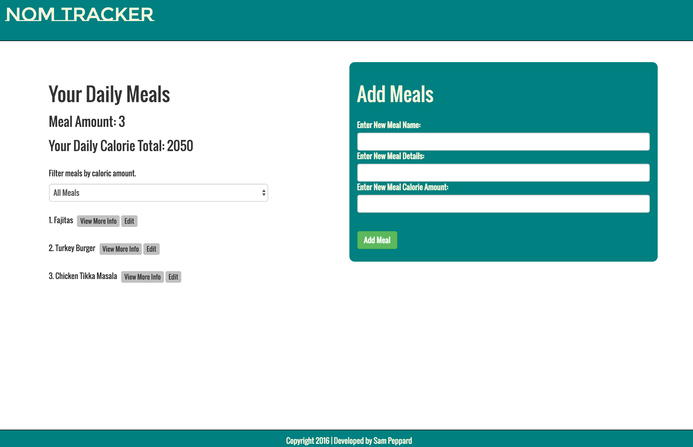

# **Nom Tracker**

##### A project built with Angular2. 10.23.2016
#
##### By [Sam Peppard](https://github.com/sampeppard)
#

----
### **Description**

An application meant to track meals and calories built with Angular2 and Gulp.js for in the asset pipeline.

----
### **Specifications**
| _Behavior_ | _Input_ | _Output_ |
|:---------------------------------------------------------------------:|:---------------------------------------------------------------------------:|:-------------------------------------------------------------------------------------------------------------------:|
| Enter a meal's name | Enter Meal Name: Fajitas | Result: Meal 1: Fajitas |
| Enter a meals's details | Enter Meal Details: The fajitas are chicken so they are lower in calories! | Result: Details: The fajitas are chicken so they are lower in calories! |
| Enter a meal's caloric amount | Enter Calorie Amount: 850 calories | Result: Meal 1: Fajitas |
| View logged meals | Select Meal | edit a meal's name, details or calorie amount |

----
### **Setup/Installation Requirements**

If editing:
* Clone this repository: https://github.com/sampeppard/nom_tracker.git
* OPEN project folder ('nom_tracker') in Code Editor of choice
#
* Run following commands from command line
* 1. npm install
* 2. bower install
* 3. gulp build
* 4. gulp serve

----

### **Known Bugs**

No known bugs.

----
### **Support and contact details**

For comments or questions, please email sampeppard@gmail.com

----
### **Technologies Used**

* HTML
* JavaScript
* jQuery
* Gulp.js
* Angular2
* Bootstrap
* npm JS package manager
* Bower package manager
----
### **License**

MIT
